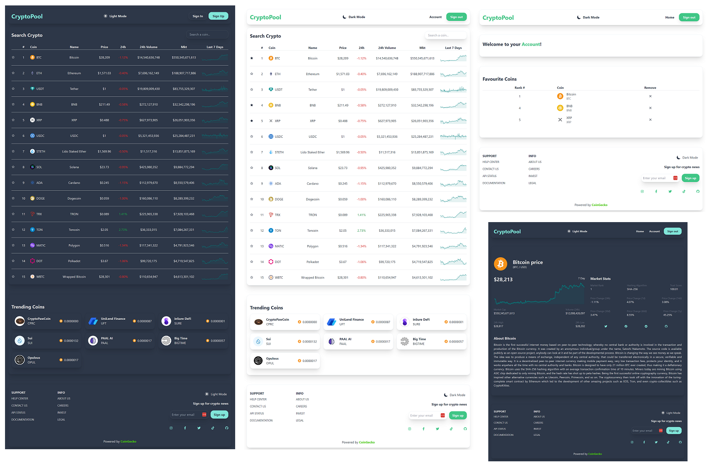

# CryptoPool

## [Live Site](https://the-crypto-pool.web.app)

 

## Description

A website for crypto coins information, that uses [CoinGecko API](https://www.coingecko.com/en/api) to fetch the data. The website gives the possibility to sign up and add and remove favourite coins to your account.

 

## Screenshot

 

## 🛠️ Built with:

